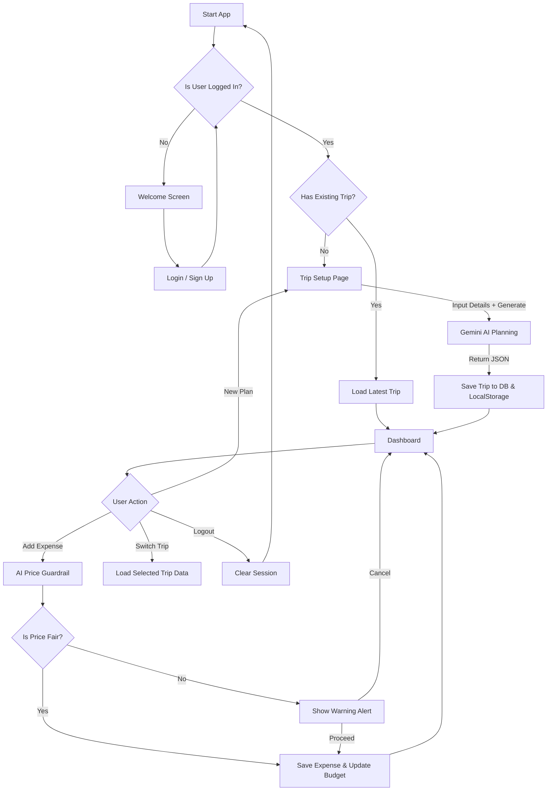

# FairFare Application Process Flow Documentation

This document outlines the logical flow of the **FairFare** budget travel application. It describes how a user interacts with the system, from authentication to expense tracking and AI interactions.

## 1. High-Level User Journey

1.  **Welcome / Landing**: User arrives at the app.
2.  **Authentication**: User signs up or logs in.
3.  **Routing Logic**: System checks if the user has an existing trip.
    *   *No Trip*: Redirect to **Trip Setup**.
    *   *Has Trip*: Redirect to **Dashboard**.
4.  **Dashboard**: User views budget, adds expenses, and manages plans.
5.  **Multi-Trip Management**: User can switch between different trip plans or create a new one.

---

## 2. Detailed Process Flows

### A. Authentication & Session Management
*   **Trigger**: User opens the app.
*   **Process**:
    1.  App initializes and listeners check `localStorage` and `Firebase Auth`.
    2.  **If Not Logged In**: Show Welcome Screen -> User clicks "Get Started" -> Show Login/Signup Form.
    3.  **If Logged In**: 
        *   App fetches User Profile.
        *   App queries Firestore for existing trips linked to `userId`.
        *   **Condition**:
            *   *Trips Found*: Load the latest trip -> Go to **Dashboard**.
            *   *No Trips*: Go to **Trip Setup**.

### B. Trip Planning (AI Generation)
*   **Trigger**: User creates account OR clicks "New Plan" from Dashboard.
*   **Inputs**: Location, Duration, Budget, Purpose.
*   **Process**:
    1.  User fills out the "Plan Your Adventure" form.
    2.  **API Call**: App sends prompt to **Google Gemini AI**.
    3.  **AI Processing**: Gemini generates JSON containing:
        *   Places to visit
        *   Local food recommendations
        *   Accommodation options
    4.  **Storage**:
        *   App creates a new Document in Firestore (`trips` collection).
        *   App saves a backup to `localStorage`.
    5.  **Output**: Redirect user to Dashboard with the new plan active.

### C. Expense Tracking with AI Guardrail
*   **Trigger**: User adds an expense (Location, Item, Cost) on Dashboard.
*   **Process**:
    1.  **AI Check**: App acts as a "Guardrail" by asking Gemini: *"Is [Cost] for [Item] in [Location] fair?"*
    2.  **Analysis**:
        *   *If Fair/Cheap*: Expense is approved automatically.
        *   *If Expensive*: Show **Warning Popup** ("Price Alert").
            *   User can *Cancel* OR *Proceed Anyway*.
    3.  **Save Update**:
        *   **Optimistic UI**: Dashboard updates numbers (Total Spent, Remaining) *instantly*.
        *   **Database**: Expense is added to Firestore subcollection (`trips/{tripId}/expenses`).
        *   **Local Cache**: Expense saved to `localStorage` for offline support.

---

## 3. Visual Flowchart (Mermaid)

You can view this diagram using any Mermaid chart viewer.

## 4. Technical Data Flow

1.  **Frontend**: React (Vite)
2.  **State Management**: React `useState` + `localStorage` (Fallback/Cache)
3.  **Backend / DB**: Firebase Firestore
    *   Collection: `users` (Profile data)
    *   Collection: `trips` (Trip metadata + AI Plan)
        *   Subcollection: `expenses` (Individual transaction logs)
4.  **AI Engine**: Google Gemini Flash Model (via API)

---
*Generated for FairFare Project Documentation*
